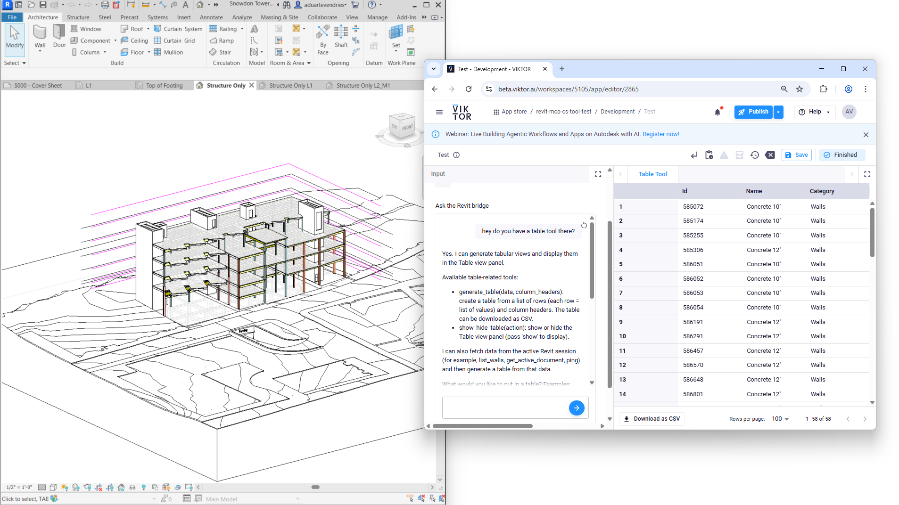

# Revit MCP Project

This repository scaffolds an integration that keeps all Autodesk Revit API code inside a normal Revit add-in and exposes tools through a local MCP server.

The outer server speaks MCP over Streamable HTTP. The bridge and Revit-side handlers remain separate so the Revit API only executes inside Revit.



## What Is In The Repo

```text
src/
  RevitMcp.Contracts/
    BridgeRequest.cs
    BridgeResponse.cs

  RevitMcp.Core/
    Services/
      DocumentService.cs
      WallService.cs

  RevitMcp.RevitAddin/
    App.cs
    CommandDispatcher.cs
    Bridge/
      BridgeExternalEventHandler.cs
      BridgeRequestBroker.cs
      LocalHttpBridge.cs
    Handlers/
      IRevitCommandHandler.cs
      PingHandler.cs
      GetActiveDocumentHandler.cs
      ListWallsHandler.cs
    Manifest/
      RevitMcp.RevitAddin.addin

  RevitMcp.Server/
    Program.cs
    BridgeClient.cs
    Tools/
      RevitTools.cs
```

## Why The Shape Looks Like This

Revit API code must run inside the Revit process and on Revit-controlled execution.

Because of that:

- `RevitMcp.RevitAddin` owns every Revit API call.
- `RevitMcp.Server` stays outside Revit and exposes MCP tools only.
- `BridgeRequestBroker` marshals incoming bridge calls through Revit `ExternalEvent` instead of calling the API directly from the listener thread.

That last point matters. A naive HTTP listener thread cannot safely read or modify the active Revit document.

## Supported Revit Versions

This project supports:

- **Revit 2024** (.NET Framework 4.8)
- **Revit 2025** (.NET 8)
- **Revit 2026** (.NET 8)

The project files automatically select the correct target framework based on the `RevitVersion` build parameter. Revit 2025+ uses the modern .NET 8 runtime, while Revit 2024 uses .NET Framework 4.8.

## Prerequisites

You need these on the machine where you will compile and run the add-in:

- Windows 10 or Windows 11
- Autodesk Revit 2024, 2025, or 2026
- .NET 10 SDK for the current server project target
- Visual Studio 2022 or another MSBuild-capable environment
- .NET Framework 4.8 Developer Pack (only required for Revit 2024 builds)

## Revit References Required To Compile

The Revit projects use direct assembly references from the local Revit installation.

For `RevitMcp.RevitAddin`:

- `RevitAPI.dll`
- `RevitAPIUI.dll`

For `RevitMcp.Core`:

- `RevitAPI.dll`

Typical install folders:

```powershell
C:\Program Files\Autodesk\Revit 2024\
C:\Program Files\Autodesk\Revit 2025\
C:\Program Files\Autodesk\Revit 2026\
```

The `.csproj` files already support either of these approaches:

1. Build by version:

```powershell
dotnet build .\RevitMcp.sln /p:RevitVersion=2024
dotnet build .\RevitMcp.sln /p:RevitVersion=2025
dotnet build .\RevitMcp.sln /p:RevitVersion=2026
```

2. Build by explicit install folder:

```powershell
dotnet build .\RevitMcp.sln /p:RevitInstallDir="C:\Program Files\Autodesk\Revit 2024"
```

If the DLLs are not found, the Revit projects fail early with a clear MSBuild error.

## Where Dependencies Are Declared

Yes. The dependencies are written in the project files already.

- `RevitMcp.sln` only lists which projects belong to the solution and how they build together.
- `.csproj` files contain the real dependency declarations.

Current dependency shape:

- `RevitMcp.RevitAddin.csproj`
  - `ProjectReference` to `RevitMcp.Contracts`
  - `ProjectReference` to `RevitMcp.Core`
  - direct `Reference` to `RevitAPI.dll`
  - direct `Reference` to `RevitAPIUI.dll`
- `RevitMcp.Core.csproj`
  - direct `Reference` to `RevitAPI.dll`
- `RevitMcp.Server.csproj`
  - `ProjectReference` to `RevitMcp.Contracts`
  - `PackageReference` to `ModelContextProtocol`
  - `PackageReference` to `ModelContextProtocol.AspNetCore`
- `RevitMcp.Contracts.csproj`
  - `PackageReference` to `System.Text.Json`

The Revit projects still use direct DLL references from the local Revit installation, while the server uses NuGet packages for MCP hosting.

## Where To Register The Add-In

Revit discovers add-ins through `.addin` manifest files.

Per-user registration folders:

```text
%AppData%\Autodesk\Revit\Addins\2024\
%AppData%\Autodesk\Revit\Addins\2025\
%AppData%\Autodesk\Revit\Addins\2026\
```

All-users registration folders:

```text
%ProgramData%\Autodesk\Revit\Addins\2024\
%ProgramData%\Autodesk\Revit\Addins\2025\
%ProgramData%\Autodesk\Revit\Addins\2026\
```

To register this demo:

1. Build `RevitMcp.RevitAddin`.
2. Edit `src/RevitMcp.RevitAddin/Manifest/RevitMcp.RevitAddin.addin`.
3. Replace the placeholder `Assembly` value with the full path to your built `RevitMcp.RevitAddin.dll`.
4. Copy the manifest into the Revit add-ins folder for the Revit version you are targeting.

Example:

```xml
<Assembly>C:\Repos\revit-mcp-cs-test\src\RevitMcp.RevitAddin\bin\Debug\net8.0-windows\RevitMcp.RevitAddin.dll</Assembly>
```

## Build Scripts

Two PowerShell scripts were added under `scripts/` for Windows development.

Build the whole solution:

```powershell
.\scripts\build-all.ps1 -RevitVersion 2026 -Configuration Debug
```

Build and register the add-in manifest for the current user:

```powershell
# For Revit 2024
.\scripts\build-all.ps1 -RevitVersion 2024 -Configuration Debug -RegisterAddin

# For Revit 2026
.\scripts\build-all.ps1 -RevitVersion 2026 -Configuration Debug -RegisterAddin
```

Build against a custom Revit installation folder:

```powershell
.\scripts\build-all.ps1 -RevitVersion 2024 -RevitInstallDir "D:\Apps\Autodesk\Revit 2024"
```

Register the manifest separately after a build:

```powershell
.\scripts\register-addin.ps1 -RevitVersion 2024 -Configuration Debug -Scope CurrentUser
```

For machine-wide registration:

```powershell
.\scripts\register-addin.ps1 -RevitVersion 2024 -Configuration Release -Scope AllUsers
```

## Manual Build And Run

### 1. Build The Revit Add-In

```powershell
# For Revit 2024 (builds against .NET Framework 4.8)
dotnet build .\src\RevitMcp.RevitAddin\RevitMcp.RevitAddin.csproj -c Debug /p:RevitVersion=2024

# For Revit 2026 (builds against .NET 8)
dotnet build .\src\RevitMcp.RevitAddin\RevitMcp.RevitAddin.csproj -c Debug /p:RevitVersion=2026
```

### 2. Register The Manifest

Copy `src\RevitMcp.RevitAddin\Manifest\RevitMcp.RevitAddin.addin` into the matching Revit add-ins folder after updating the `Assembly` path.

### 3. Start Revit

Launch Revit 2024, 2025, or 2026 (whichever version you built for) and open any project.

When Revit finishes initialization, the add-in starts a local bridge listener at:

```text
http://127.0.0.1:5057/
```

### 4. Build And Run The MCP Server

```powershell
dotnet build .\src\RevitMcp.Server\RevitMcp.Server.csproj -c Debug
dotnet run --project .\src\RevitMcp.Server\RevitMcp.Server.csproj
```

The MCP server listens on:

```text
http://127.0.0.1:5099
```

### 5. Connect An MCP Client

Streamable HTTP endpoint:

```text
http://127.0.0.1:5099/mcp
```

Smoke-test the MCP endpoint with the included script:

```powershell
pip install mcp
python .\scripts\test-mcp-server.py
python .\scripts\test-mcp-server.py --tool ping
python .\scripts\test-mcp-server.py --tool get_active_document
python .\scripts\test-mcp-server.py --tool list_walls
python .\scripts\test-mcp-server.py --tool get_hvac_critical_path_data --arguments "{\"elementId\":123456}"
```

## Initial Tool Set

The scaffold includes four read-only tools:

- `ping`
- `get_active_document`
- `list_walls`
- `get_hvac_critical_path_data`

That is enough to prove:

- the Revit add-in loaded
- the bridge is reachable
- the request is marshaled back into Revit safely
- data can be returned from the active document

### HVAC Critical Path Export

`get_hvac_critical_path_data` resolves a `MechanicalSystem` from either:

- `systemId`
- `elementId`

The tool validates that the system is well connected and then returns a JSON-safe payload with:

- system id and name
- `PressureLossOfCriticalPath`
- ordered critical-path sections with section sequence, flow, velocity, and member element ids
- per-element rows for ducts, flex ducts, fittings, accessories, and terminals on the critical path
- type metadata and basic geometry such as length, diameter, width, and height
- a primary connector profile snapshot for fitting-style elements

This tool is intended as the Revit-side export layer for external HVAC analysis. The follow-up calculation and report generation can happen outside Revit, for example in Python or VIKTOR. Writing values, flags, or heatmap overrides back into Revit should remain a separate tool because those operations are transactional.

## Notes About The Bridge

The add-in uses `HttpListener` for a local demo bridge. This is simple to inspect and easy to test, but it is not the best production choice.

For a production hardening pass, consider:

- named pipes instead of HTTP
- a shared secret or local auth guard
- structured logging
- timeouts
- request validation
- explicit exception mapping
- queued execution limits

Depending on the Windows machine policy, `HttpListener` may require a URL ACL reservation. If needed, run this once in an elevated shell:

```powershell
netsh http add urlacl url=http://127.0.0.1:5057/ user=%USERNAME%
```

## Notes About The MCP Server

The outer server already exposes a real MCP surface over Streamable HTTP.

That means:

1. MCP clients can discover tools from the protocol.
2. The C# server remains a thin wrapper around `BridgeClient`.
3. The Revit add-in is still registered only through the Revit `.addin` manifest.

## Write Operations

Start with read-only tools first. When you add write tools, perform them inside a normal Revit transaction.

Example pattern:

```csharp
using (var tx = new Transaction(doc, "Create Demo Wall"))
{
    tx.Start();

    // Revit API write operations go here.

    tx.Commit();
}
```

## Suggested Next Steps

- add `get_active_view`
- add `list_levels`
- add `list_rooms`
- add `list_sheets`
- add one safe write operation behind a transaction
- add more MCP tools as needed

## Reference Links

- [Autodesk Revit 2025 .NET 8 upgrade notes](https://help.autodesk.com/cloudhelp/2025/ENU/Revit-WhatsNew/files/GUID-50024FD2-16BE-40BE-96E6-550294D9537D.htm)
- [Autodesk Revit API migration notes from .NET 4.8 to .NET 8](https://help.autodesk.com/cloudhelp/2025/CHS/Revit-API/files/Revit_API_Developers_Guide/Introduction/Getting_Started/Using_the_Autodesk_Revit_API/Revit_API_Revit_API_Developers_Guide_Introduction_Getting_Started_Using_the_Autodesk_Revit_API_NET8_Update_html.html)
- [Autodesk Revit add-in registration and manifest locations](https://help.autodesk.com/cloudhelp/2016/KOR/Revit-API/files/GUID-4FFDB03E-6936-417C-9772-8FC258A261F7.htm)
- [Autodesk Revit 2025 Hello World walkthrough for .NET 8 projects](https://help.autodesk.com/cloudhelp/2025/ESP/Revit-API/files/Revit_API_Developers_Guide/Introduction/Getting_Started/Revit_API_Revit_API_Developers_Guide_Introduction_Getting_Started_Walkthrough_Hello_World_html.html)
- [Microsoft `System.Net.HttpListener` documentation](https://learn.microsoft.com/en-us/dotnet/fundamentals/runtime-libraries/system-net-httplistener)
